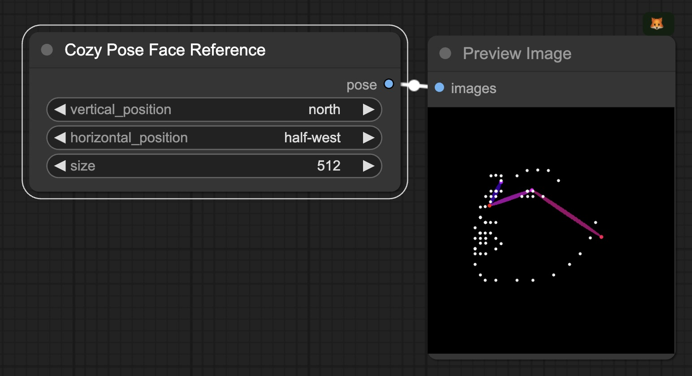
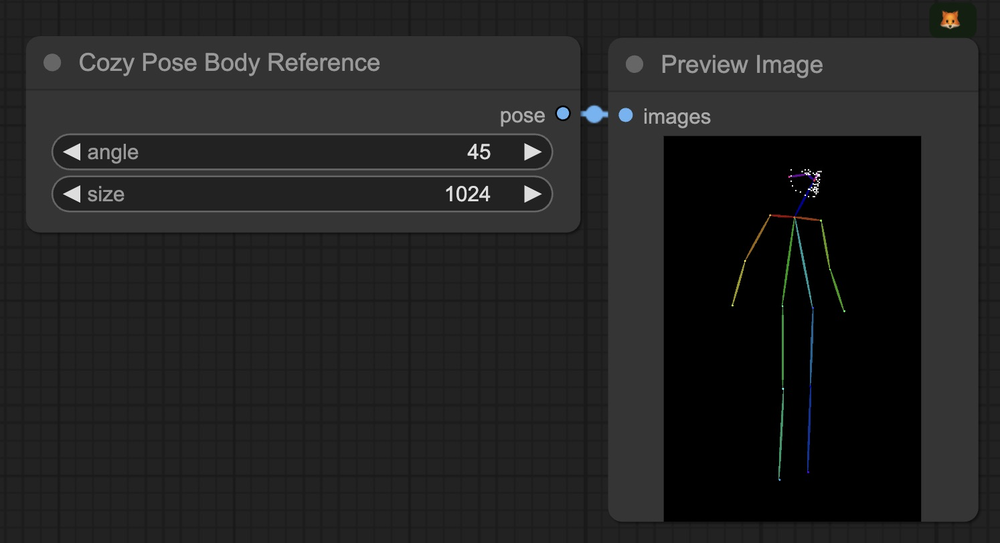

# Cozy Face/Body Reference Pose Generator

Generate OpenPose poses and build character reference sheets in ComfyUI with ease. Made with 💚 by the CozyMantis squad.

## Installation

- Clone this repo into the `custom_nodes/cozy-pose-generator` directory, then run `pip install -r requirements.txt` to install the required dependencies.

## Face Reference

## Body Reference

## Example Workflows

### Cozy Character Face Generator - ComfyUI SD 1.5 Workflow For Reference Sheets

https://cozymantis.gumroad.com/l/character-face-reference-sheet-comfyui-workflow-sd15

